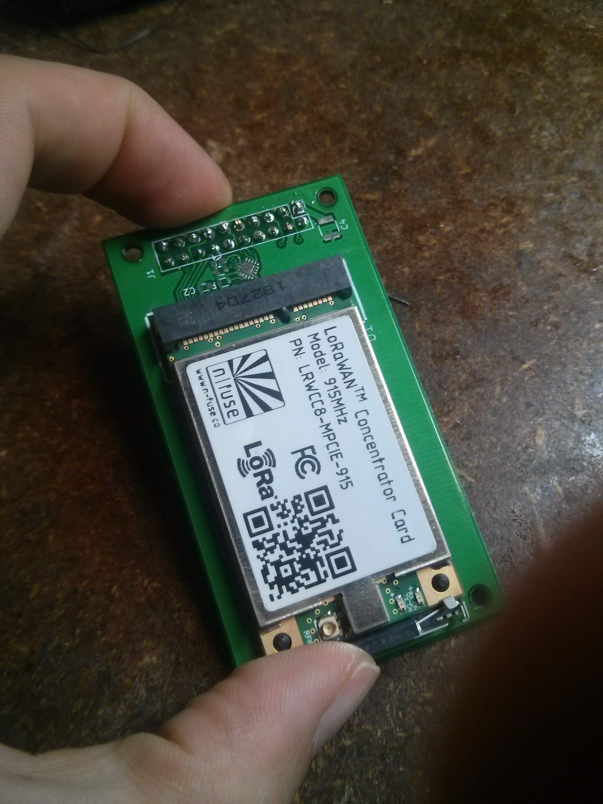
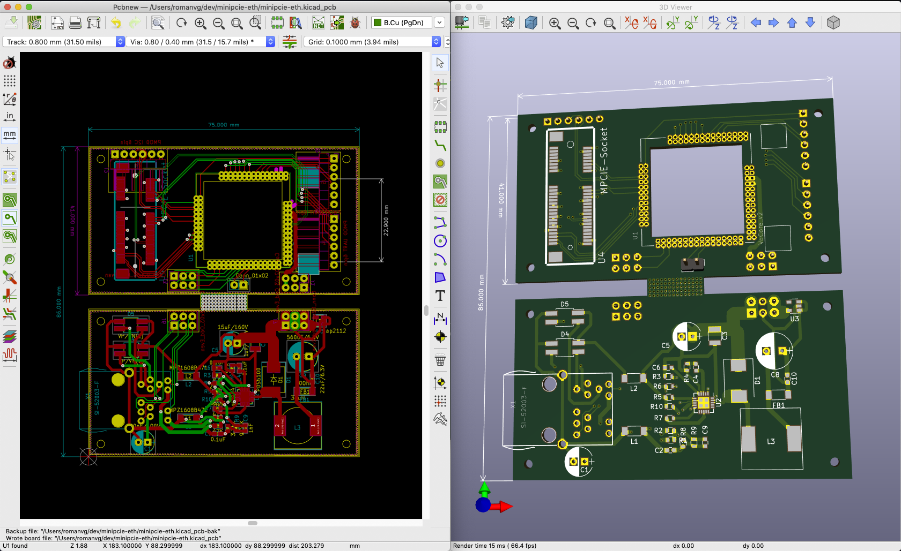
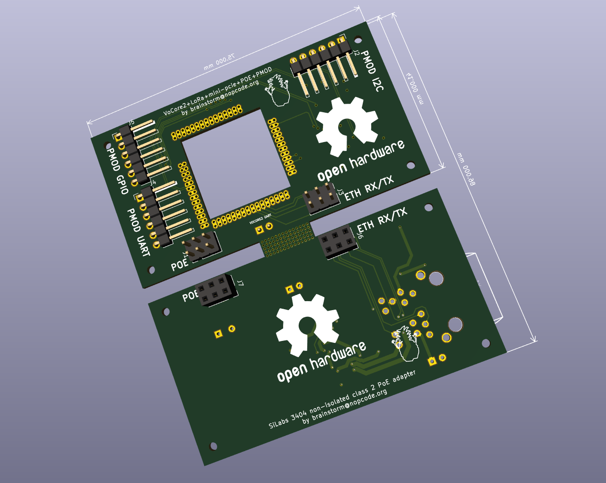

# Mini-PCIe LoRa Gateway with PMOD and POE

This small LoRa gateway adapter (75x41mm) is motivated by the generous donation of a (n-fuse)[https://www.n-fuse.co/]'s LoRaWan [concentrator card](https://www.n-fuse.co/devices/LoRaWAN-Concentrator-Card-mini-PCIe.html). **This version of the board is meant to work with the USB firmware for the n-fuse board**:

Future versions might switch to the UART version of the n-fuse firmware.

RAK wireless boards might work with this adapter, but they are not tested... [I'm open to receive a RAKWireless board to try it out :)](https://twitter.com/RAKwireless/status/1138038732207087616?s=19).

The intention with this board is to have a maker-friendly LoRa gateway base design for modular gateways that incorporates the [PMOD flexibility](https://reference.digilentinc.com/_media/reference/pmod/pmod-interface-specification-1_2_0.pdf).

One could think it as a fusion of the following new developments (before they actually existed):

https://github.com/electroniceel/vocore2-breakout

https://m2m-tele.com/product/gw-01-poe/

# Software

There's the OpenWrt package that accompanies this work (and needs just a little bit more OSS love):

https://github.com/openwrt/packages/pull/8264

Which is pretty much a way to upstream the work shown by [Felix Wiedemann on hackster.io](https://www.hackster.io/fewi/build-a-lora-gateway-with-n-fuse-mpcie-card-71f0e1) with several UX improvements.

All in all, a neat experiment with 4 layer board design as a hobby while collaborating with a great company.

Thanks again n-fuse!
